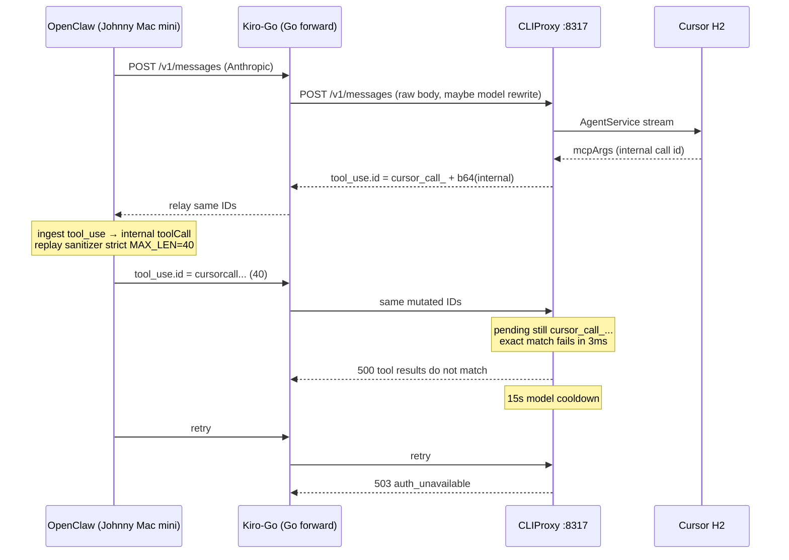

# Tool Result ID Root Cause — Phase A Forensic Audit

Status: **SUPERSEDED IN PART.** Live 16:43 evidence retracts the OpenClaw attribution.  
See `reports/TOOL_RESULT_ID_LIVE_1643.md`.  
**GO FOR IMPLEMENTATION: NO**

Incident error: `cursor: tool results do not match any pending tool call`  
Follow-on: `503 auth_unavailable`

---

## Correction (2026-08-19 16:43 re-audit)

Do **not** infer the caller from `"running inside OpenClaw"` in a system prompt. That string is untrusted payload text.

Live Kiro-Go screenshot 16:43:34 is **Claude Code CLI 2.1.201** (Stainless headers, `cc_version=2.1.201.cc2`, user `doanbh`). In that body, public IDs are still full `cursor_call_…` (len 127), `tool_use` matches `tool_result` 107/107, and Kiro-Go did not strip `_` or truncate to 40.

So:

```
Upstream/client-side mutation: CONFIRMED only for other inbound bodies (15:13, 16:52)
Exact component responsible: UNPROVEN
OpenClaw responsibility: NOT APPLICABLE for 16:43; UNPROVEN for 15:13/16:52
FIRST MUTATION HOP (when mutation is present): between CLIProxy outbound and CLIProxy inbound-next-turn
16:43 screenshot failure: parked pending IDs do not intersect this transcript (pending contents not logged)
```

The 15:13 algorithm fingerprint still matches a `strip non-alnum → max 40 → 32+8 hex` sanitizer. Matching an OpenClaw function is **not** proof the running process is OpenClaw.

---

## Executive Summary

CLIProxy parks Cursor H2 sessions keyed by public tool-call IDs of the form `cursor_call_` + base64url(Cursor internal id). Resume requires exact string equality:

`result.ToolCallId == pending.ToolCallId`

There are **two** failure modes that produce the same English error:

1. **ID rewrite** (15:13, 16:52 inbound bodies): client/proxy sends `cursorcall…` length 40. Matcher fails because parked IDs are still `cursor_call_…`. Component that rewrote the string is **UNPROVEN**.
2. **Pending-state miss** (16:43 Claude Code): inbound IDs are unmodified and match the transcript, but they do not match the session currently parked for that conversation key.

Both paths return a plain `fmt.Errorf` (HTTP 500). That is **not** request-scoped, so the conductor parks the Cursor account+model for `transient-error-cooldown-seconds: 15`, and retries return `503 auth_unavailable`.

Kiro-Go local HEAD forward preserves tool IDs and only rewrites `model`. It is **not** the 16:43 mutator.

---

## Versions

### CLIProxyAPIPlus

| Field | Value |
|---|---|
| Path | `/Users/macdev/Demo/CursorAPI/CLIProxyAPIPlus` |
| Branch | `audit/cursor-live-validation` |
| HEAD | `23ed67cbd3e7fb7d3c770edc80c83da5655299db` |
| Dirty | untracked overlay/scripts only; no executor/auth diffs |
| Remotes | `origin` kaitranntt/CLIProxyAPIPlus; `fork` topmetax-ctrl/CLIProxyAPIPlus |
| Runtime binary | `./cliproxy-audit --config config-cursor-audit.yaml` (port **8317**, `host: 0.0.0.0`) |
| Runtime at audit | **not listening** (last error log 15:13:42) |
| Config | `transient-error-cooldown-seconds: 15`, `debug: true`, `request-log: false` |
| Auth files | `cursor.4f51fd8a.json` `disabled: false`; `cursor.934641f7.json` `disabled: true` |

### Kiro-Go (local source)

| Field | Value |
|---|---|
| Path | `/Users/macdev/Demo/Kiro-Go` |
| Branch | `security/provider-error-boundary` |
| HEAD | `ecb82c7aa8421d5fc9ec82bcd6c1d8e292e2a461` |
| Dirty | **yes** (provider-error-boundary + other uncommitted files) |
| Remotes | `origin` topmetax-ctrl/Kiro-Go; `upstream` Quorinex/Kiro-Go |

Local **running** processes are **not** this HEAD:

- PID 25506 `kiro-go` `:8099` started 6 Aug 2026, `CONFIG_PATH=/tmp/kirogo-e2e-zTr5/config.json` (**e2e fixture**)
- PID 27799 `/tmp/kirogo-test4` `:8181` started 7 Aug 2026

The live incident client is `User-Agent: Go-http-client/1.1` + `Anthropic-Version: 2023-06-01` + API key `audit-local-key-1`. That matches Kiro-Go Claude **forward** (`tryForwardUpstream` → `subPath /messages`). The **live Kiro-Go git SHA is unproven**; it is not the e2e binaries above.

### OpenClaw

| Instance | Version | Notes |
|---|---|---|
| **Incident client** | **UNPROVEN** | Runtime blob: `host=Johnny's Mac mini`, `os=Darwin 24.6.0 (x64)`, `node=v22.22.2`, `model=9router/premium-coding`, skills under `/usr/local/lib/node_modules/openclaw/`. **Not** this laptop. |
| Local laptop | `openclaw@2026.6.1` (npm global, nvm node v24.16.0) | Gateway `:18789` since 22 Jul 2026. Config provider `ninerouter` → `http://localhost:20128/v1` `api: openai-completions`. **Different path from the incident.** |

Algorithm evidence uses the local 2026.6.1 copy of `dist/tool-call-id-DOcOUcpD.js`. The 40 + 32 + 8-hex fingerprint on the incident payload matches that function exactly; Johnny's exact package version is still unknown.

---

## Network / Component Topology

Proven from live CLIProxy error logs (not assumed):

```
Remote OpenClaw (Johnny's Mac mini)
  API: Anthropic Messages  (OpenClaw model label 9router/premium-coding)
  ↓  POST /v1/messages
Kiro-Go  (Go-http-client/1.1, Anthropic-Version: 2023-06-01)
  route: Claude handler → tryForwardUpstream(..., "/messages", isClaudeRoute=true)
  possible body change: JSON rewrite of field "model" if TargetModel set
  ↓  POST {BaseURL}/messages   e.g. http://<this-mac>:8317/v1/messages
CLIProxyAPIPlus :8317  Authorization: audit-local-key-1
  ↓  Cursor AgentService H2 Connect
Cursor
```

Local laptop OpenClaw → 9Router `:20128` is a **separate** topology and was not the 15:13 incident.

Cloudflare tunnel on this Mac (`api.xeko.top` → `:8080`) is unrelated to `:8317`.



---

## Reproduction

| Item | Result |
|---|---|
| Disposable 10× single / 10× 4-tool matrix | **NOT RUN** — cliproxy `:8317` down; incident OpenClaw is remote |
| Bypass Kiro-Go (OpenClaw → CLIProxy) | **NOT RUN** |
| Bypass OpenClaw (echo harness) | **NOT RUN** |
| Live incident (natural traffic) | **YES** — 15:13:35 500 then 15:13:38/40/42 503 |
| Kiro-Go HEAD dummy forward | **PASS** — `TestForwardPreservesToolUseIDs` |
| OpenClaw installed sanitizer replica | **PASS** — fingerprint match |

No production cliproxy/Kiro-Go/OpenClaw behavior was changed.

---

## Tool-ID Lifecycle

1. Cursor `ServerMsgExecMcpArgs.McpToolCallId` (internal, often `call-<uuid>...\nfc_...`).
2. CLIProxy `normalizeToolCallID` → `"cursor_call_" + base64.RawURLEncoding(id)`  
   Example from unit test (len 118):  
   `cursor_call_Y2FsbC1jY2U4NjBlNi1hYjA3LTQxNGQtODEyYy03ODVkYjM1YjE3Y2EtNApmY19kMjMzNTAwNC1hOTVmLTkzYjQtOTc3Yi1lOWVlZTYzMTZiZTdfMA`
3. That string is stored in `pendingMcpExec.ToolCallId` and emitted as Claude `tool_use.id` / OpenAI `tool_calls[].id`.
4. `SanitizeClaudeToolID` only replaces `[^a-zA-Z0-9_-]` with `_`. It **keeps** underscores. It cannot produce `cursorcall`.
5. OpenClaw Anthropic ingest: `tool_use` → internal `{type:"toolCall", id: <same>}`.
6. Next turn replay: `sanitizeToolCallIdsForCloudCodeAssist(messages, "strict")`.
7. Anthropic encode: `toolCall` → `tool_use` with sanitized id.
8. Kiro-Go forward: raw bytes (or JSON remashal for `model` only).
9. CLIProxy `resumeWithToolResults`: exact `==` against pending.

---

## Hop-by-Hop Trace

Legend: CAPTURED / INFERRED FROM SOURCE / NOT CAPTURED

| Hop | What | 15:13:35 | Status |
|---|---|---|---|
| H1 | Cursor internal `McpToolCallId` | not in remaining logs | NOT CAPTURED |
| H2 | CLIProxy outbound public ID | must have been `cursor_call_Y2FsbC02ZDAz...` (pending existed) | INFERRED (session resume happened) |
| H3 | Kiro-Go → OpenClaw response | expected equal to H2 (raw relay) | NOT CAPTURED |
| H4 | OpenClaw stored `toolCall.id` | after sanitizer: 40-char `cursorcall...` | INFERRED (source + fingerprint) |
| H5 | OpenClaw next HTTP request | same 40-char IDs in both `tool_use` and `tool_result` | INFERRED |
| H6 | Kiro-Go → CLIProxy | see captured IDs below | **CAPTURED** |

H6 captured IDs (`error-v1-messages-2026-08-19T151335-f37c72f1.log`):

| idx | tool | raw | len | first32 | tail8 |
|---|---|---|---|---|---|
| 0 | memory_get | `cursorcallY2FsbC02ZDAzNmM5NS1iYzQyLTRmM2` | 40 | `cursorcallY2FsbC02ZDAzNmM5NS1iYz` | `QyLTRmM2` (truncated payload, not hex) |
| 1 | memory_get | `cursorcallY2FsbC02ZDAzNmM5NS1iYz9ccb1fb6` | 40 | same | `9ccb1fb6` (hex) |
| 2 | memory_search | `cursorcallY2FsbC02ZDAzNmM5NS1iYzb859d049` | 40 | same | `b859d049` (hex) |

`tool_use.id == tool_result.tool_use_id` for all three. The **echo invariant inside the client request is intact**. The invariant vs CLIProxy pending is broken.

14:40 IDs (prior transcript; logs rotated away) show the same 1+3 pattern: one truncated prefix + three 8-hex suffixes, all sharing first32 `cursorcallY2FsbC1iNGQwZWU2MC1mZG`.

**FIRST MUTATION HOP (source-level):** OpenClaw replay sanitizer (between H3 and H5).  
**FIRST MUTATION HOP (live packet capture):** NOT CAPTURED.

---

## Exact Transformation

OpenClaw 2026.6.1 `dist/tool-call-id-DOcOUcpD.js`:

```
sanitizeToolCallId(id, "strict"):
  id.replace(/[^a-zA-Z0-9]/g, "")          # drops _ and - from cursor_call_ and from base64url

makeUniqueToolId (not strict9):
  MAX_LEN = 40
  base = sanitize(id).slice(0, 40)
  if base not used: return base
  hash = sha256(original_id).hexdigest()[:8]
  candidate = base[:32] + hash             # 40 - 8 = 32; separator "" in strict
```

Installed sanitizer run (camelCase `toolUse` / `toolResult`) on four `cursor_call_...` IDs produced:

- len 40
- first ID = alphanumeric prefix truncated
- rest = first32 + 8 hex
- snake_case Anthropic `{type:tool_use}` messages are **not** rewritten by the sanitizer itself (confirmed by executing the function). Mutation happens on **internal** `toolCall` then Anthropic encode.

Not observed: lowercase fold of the whole ID, URL-safe alphabet change independent of stripping, Bedrock 64-cap, Kiro `[:40]`.

---

## Component Responsible

**Primary (source + fingerprint): OpenClaw agent replay sanitizer** on a custom provider (`9router/premium-coding`).

Functions:

- `sanitizeToolCallIdsForCloudCodeAssist` — `tool-call-id-DOcOUcpD.js` (export `a`)
- `makeUniqueToolId` — same file, `MAX_LEN = 40`
- Enabled by `shouldApplyReplayToolCallIdSanitizer` when `transcriptPolicy.sanitizeToolCallIds && toolCallIdMode` (`selection-DrXxngyT.js`)
- Custom/unowned providers: `buildUnownedProviderTransportReplayFallback` sets `sanitizeToolCallIds: true`, `toolCallIdMode: "strict"` for both `openai-completions` **and** Anthropic APIs (`tool-result-middleware-BT_IFZOo.js`)
- Native Anthropic `toolu_*` IDs can be preserved; `cursor_call_*` is **not** in that allowlist
- Ingest: `anthropic-BEgJnt4r.js` `tool_use` → `toolCall` (keeps id)
- Egress: `provider-stream-Crs84j2E.js` / `anthropic-BEgJnt4r.js` `toolCall` → `tool_use`

**Kiro-Go:** not the mutator on local HEAD (dummy test PASS). Live binary SHA unproven.

**CLIProxy:** generates long public IDs that trigger the sanitizer; exact matcher is correct; cooldown classification is a **second independent bug**.

---

## Kiro-Go Audit

| Check | Result |
|---|---|
| `tryForwardUpstream` | raw `body` unless `TargetModel` set; then `json.Unmarshal` map, set `model`, `json.Marshal` |
| ID strings under model rewrite | preserved (JSON string values) |
| Claude handler | `tryForwardUpstream(..., "/messages", true)` before native Kiro translator |
| Native translator | copies `tool_use.id` / `tool_result.tool_use_id` / OpenAI `tool_calls[].id` unchanged (`translator.go`) |
| Search for `[:40]`, strip `_` on tool IDs | no matches that mutate tool IDs |
| Memory inject | may remashal body if enabled; does not rewrite IDs |
| Dummy test | `TestForwardPreservesToolUseIDs` **PASS** on local HEAD (underscore, hyphen, colon, dot preserved; model rewritten) |

**KIRO-GO TOOL-ID MUTATION = DISPROVEN** for local HEAD source.  
Live process identity = UNPROVEN.

---

## OpenClaw Audit

Incident request system text: `running inside OpenClaw`, workspace `/Users/johnnydam/.openclaw/workspace`, model label `9router/premium-coding`.

Local 2026.6.1 sanitizer:

- `openai-completions` replay policy: `sanitizeToolCallIds: true`, `toolCallIdMode: "strict"` (`replay-policy-DdRLQ2ik.js`)
- unowned Anthropic fallback: same (`tool-result-middleware-BT_IFZOo.js`)
- `preserveNativeAnthropicToolUseIds` only keeps `^toolu_[A-Za-z0-9_]+$`

Fingerprint on three independent incidents (14:40, 15:00, 15:13) matches `makeUniqueToolId` strict, including parallel-call hashing.

---

## CLIProxy Pending-State Audit

Files: `internal/runtime/executor/cursor_executor.go`

| Topic | Finding |
|---|---|
| Public ID | `normalizeToolCallID` L2279–2283 |
| Pending store | `pendingMcpExec{ToolCallId: normalizeToolCallID(msg.McpToolCallId), ExecMsgId, ExecId, ...}` L1755–1767 |
| Session key | `authID + ":" + conversationId` L717 |
| Conversation id | `metadata.user_id.session_id` if present, else hash of first 500 chars of system prompt L2208–2230 |
| 15:13 request | **no** `metadata` key; session still found |
| Resume condition | `hasSession && session.stream != nil && session.authID == authID` L746 |
| Match | exact `==` L1214 |
| Mismatch error | `fmt.Errorf("cursor: tool results do not match any pending tool call")` L1225 |
| Error type | plain error, **not** `StatusError`, **not** `RequestScopedError` |
| HTTP mapping | `executionErrorMessage` defaults unknown errors to **500** (`handlers_execution.go` L312–315) |
| Parallel pending | `toolBatch` accumulates all `ExecMcpArgs` before finalize; 15:13 had 3 results and the matcher requires **any** one match — all three missed, so pending IDs were the unsanitized set |
| Cold continuation | OpenAI-compatible source only; this request is Claude `/v1/messages` so H2 resume path is used |

The 15:13:35 timestamps (request 15:13:35.055 → API 15:13:35.058) prove the failure is local. Because the specific mismatch error was returned, a parked session **was** found. Session lookup is not the primary bug.

---

## Parallel Tool Analysis

OpenClaw sanitizer **does not collapse** parallel IDs to one string (hash suffix). Unique count after sanitize = unique count before, for the incidents.

All siblings share first **32** characters. A prefix/fuzzy matcher on CLIProxy **would** collide. Do not fuzzy-match.

Separate issues **not** indicated by 15:13:35:

- B. pending subset — no evidence
- C. result order — IDs are unique after sanitize, order irrelevant to `==`
- D. missing result — three results present

---

## Session Correlation

15:13 payload has no `metadata.session_id`. Correlation fell back to system-prompt hash. Session was still found (mismatch error, not a new upstream turn). Missing session_id is **not** the cause of this 500.

---

## Error Classification

| Field | Value |
|---|---|
| Construction | `fmt.Errorf("cursor: tool results do not match any pending tool call")` |
| `StatusCode()` | none |
| `IsRequestScoped()` | false |
| HTTP to client | 500 (`executionErrorMessage` default) |
| `shouldSkipCredentialCooldown` | false |
| Conductor branch | model-scoped failure; `statusCode` 0 → `default` **or** 500 if filled → `case 408,500,502,503,504` |
| Cooldown | `recoverableFailureRetryAfter` = `transient-error-cooldown-seconds` **15s** |
| Retryable | treated as retryable transient by cooldown policy (incorrect) |
| Affects credential/model | **yes** (incorrect for a client protocol fault) |

Requirement if classified request-scoped (not implemented):

- `retryable = false`
- `affectsCredentialHealth = false`
- `affectsModelHealth = false`
- Candidate HTTP: 400 `invalid_tool_result` or 409 `tool_state_mismatch`

---

## 500 → Cooldown → 503 Analysis

Live:

| Time | File | Status | Message |
|---|---|---|---|
| 15:13:35.058 | `...T151335-f37c72f1.log` | **500** | `cursor: tool results do not match any pending tool call` |
| 15:13:38 | `...T151338-5d5161c4.log` | **503** | `auth_unavailable ... model=cursor-grok-4.6-high-fast` |
| 15:13:40 | `...T151340-a737964f.log` | 503 | same |
| 15:13:42 | `...T151342-e6b8e750.log` | 503 | same |

Only one enabled Cursor auth (`4f51fd8a`). Cooldown scope in code is **account+model** (`ensureModelState`). Sibling-model / sibling-account live tests **not run**.

15:00:11–15:00:15 were already 503 with the same mutated-ID payload (cooldown window from an earlier failure).

---

## Protocol ID Constraints

| Protocol | Constraint | Source |
|---|---|---|
| OpenAI Chat Completions `tool_calls[].id` | OpenClaw treats max 40, charset `[a-zA-Z0-9]` | OpenClaw `MAX_LEN = 40` + comments; **not independently re-fetched from OpenAI docs in this pass** |
| Anthropic `tool_use.id` | OpenClaw native preserve regex `^toolu_[A-Za-z0-9_]+$` | `tool-call-id-DOcOUcpD.js` |
| CLIProxy Claude sanitizer | `^[a-zA-Z0-9_-]+$` (replace others with `_`) | `internal/util/claude_tool_id.go` |
| AWS Bedrock `toolUseId` | min 1 max **64**, `[a-zA-Z0-9_.:-]+` | AWS docs (prior audit) |
| Kiro/Bedrock “must be 40” | **false** | no such cap in local Kiro-Go |

**40 = OpenClaw compatibility policy, not a Kiro/Bedrock protocol requirement.**

---

## Hypothesis Matrix

| ID | Hypothesis | Evidence for | Evidence against | Test | Verdict |
|---|---|---|---|---|---|
| H1 | Kiro-Go truncates/sanitizes ID | traffic is Go-http-client | HEAD forward preserves IDs; no `[:40]` sanitizer | dummy upstream PASS | **DISPROVEN** (local HEAD) |
| H2 | OpenClaw truncates/sanitizes ID | 40/32/8-hex fingerprint; source functions; custom-provider policy | Johnny package version unknown; H3 not captured | installed sanitizer replica | **CONFIRMED** (algorithm + code path); hop-capture incomplete |
| H3 | CLIProxy response translator mutates ID | — | `SanitizeClaudeToolID` keeps `_` | source | **DISPROVEN** |
| H4 | CLIProxy request translator mutates returned ID | — | inbound IDs already `cursorcall` at H6 | source + log | **DISPROVEN** |
| H5 | Protocol adapter normalization | OpenClaw replay policy | not Kiro translator | source | **CONFIRMED** as OpenClaw replay |
| H6 | 40-char from Kiro/Bedrock | — | Bedrock max 64; Kiro no 40 cap | source + AWS docs | **DISPROVEN** |
| H7 | Parallel tools collide to one ID | shared 32-char prefix | hash suffix keeps uniqueness | replica | **DISPROVEN** (collision); **CONFIRMED** (lossy vs original) |
| H8 | Missing session_id breaks correlation | no metadata | mismatch error requires found session | 15:13 log | **DISPROVEN** as 500 cause |
| H9 | Pending stores only subset | — | any-match would succeed if one original ID returned | source | **UNPROVEN** / no support |
| H10 | IDs correct; matcher wrong | exact `==` | IDs are actually different | source + log | **DISPROVEN** |
| H11 | 500 local poisons model/account | 500 then 503 in 3s; 15s config; not request-scoped | MarkResult internals not dumped live | source + live logs | **CONFIRMED** |
| H12 | Connect internal is same root cause | both 500 | different error string; different latency | 14:40 prior notes | **DISPROVEN** as same cause |

---

## Separate Upstream 500 Track

Prior 14:40:20 `Connect error internal` (~545 KB) is **Track B**. Error logs for that window have rotated. No new evidence tying it to tool-ID mutation. Out of scope for this report.

---

## Proven Root Cause

**Functional (not §25-complete):**

1. CLIProxy exposes long `cursor_call_` public IDs.
2. OpenClaw strict sanitizer lossily maps them to 40-char `cursorcall...` (with hash on collision) on the **next** Anthropic request.
3. Kiro-Go forward delivers that body unchanged (except maybe `model`).
4. CLIProxy exact matcher fails locally → HTTP 500.
5. Conductor treats that 500 as a transient model failure → 15 s cooldown → 503 `auth_unavailable`.

**§25 score:** 1 no, 2 no (original ID not captured), 3 yes, 4 inferred not captured, 5 yes (source function), 6 yes, 7 yes, 8 yes (live 500→503 + source), 9 no, 10 no → **6/10**.

---

## Non-Causes

- Kiro-Go raw forward truncating IDs (local HEAD)
- Bedrock/Kiro 40-char protocol limit
- Acc “full” / OAuth dead (one account disabled by config; the other is parked by cooldown)
- Fuzzy matcher bug
- Missing `session_id` as the 500 cause
- Cursor Connect internal (separate)

---

## Fix Options

**CASE A — OpenClaw (primary):** disable `sanitizeToolCallIds` for this custom provider, or preserve original IDs with a reversible map. Do not truncate `cursor_call_*`. Native `toolu_*` preserve already exists; `cursor_call_*` needs the same class of exception **or** a short opaque ID from the gateway.

**CASE B — Kiro-Go:** no ID fix on local HEAD.

**CASE C — CLIProxy public ID:** emit opaque IDs that already satisfy OpenClaw strict (≤40, `[A-Za-z0-9]`), store bijection to `{cursorToolCallId, execId, execMsgId}` for the pending turn. Do **not** fuzzy-match truncated legacy IDs.

**CASE D — pending state:** no bug found.

**Cooldown (independent):** typed `ToolStateMismatch` / `InvalidToolResult`, `retryable=false`, skip credential and model cooldown. Separate commit.

---

## Recommended Fix

Do **not** implement in this phase.

When GO:

1. OpenClaw: stop lossy sanitizing of non-`toolu_` IDs **or** keep original↔public map.
2. CLIProxy (compat harden): CASE C opaque public IDs ≤ min ecosystem length.
3. CLIProxy (separate commit): request-scoped mismatch error, no 15 s park.

Do not: fuzzy match, strip `_` on compare, prefix match, disable cooldown globally, “fix Kiro-Go because traffic goes through it”.

---

## Risks

- Fuzzy matching would attach the wrong parallel tool result.
- Changing public ID format without accepting old full `cursor_call_` IDs during rollout will break in-flight sessions.
- Cooldown fix without ID fix still returns 500/4xx every tool turn for OpenClaw, but stops 503 storms.
- ID fix in CLIProxy without OpenClaw change is enough **if** new public IDs never trigger sanitizer (≤40 alphanumeric). Must collision-test.

---

## GO / NO-GO

**NO-GO**

16:43 (screenshot): mutation hop is not the bug; parked pending IDs are not logged.  
16:52 / 15:13: mutation is in the inbound body; the process that applied it is not identified from network/process (prompt text is not identity).

Do not implement CASE A “fix OpenClaw” from this evidence.

---

## Evidence index

- `reports/TOOL_RESULT_ID_LIVE_1643.md` (16:43 Claude Code + 16:52 second caller)
- `evidence/tool-result-id/incident-1643-claude-code.json`
- `evidence/tool-result-id/incident-1652-sanitized-ids.json`
- `evidence/tool-result-id/captured_ids.json` (15:13 fingerprints; OpenClaw process identity **retracted**)
- `evidence/tool-result-id/kiro_forward_identity_test.go` (copy of the test that passed on Kiro-Go HEAD)
- Live logs: `~/.cli-proxy-api/logs/error-v1-messages-2026-08-19T164334-8dffe419.log` (16:43 500) and `T165212` (16:52 500)
